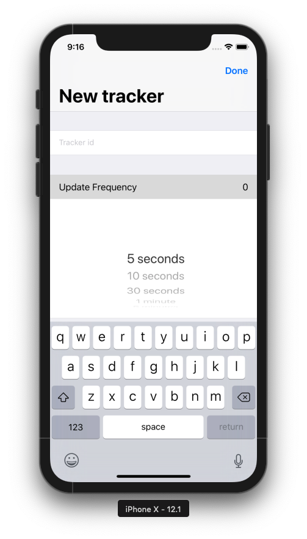
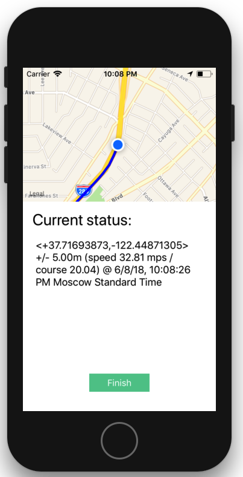
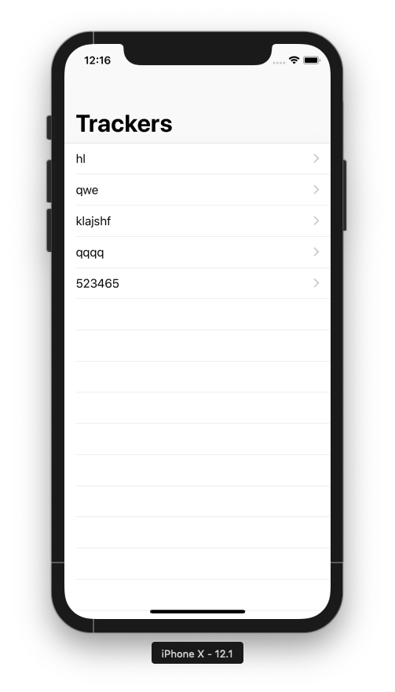
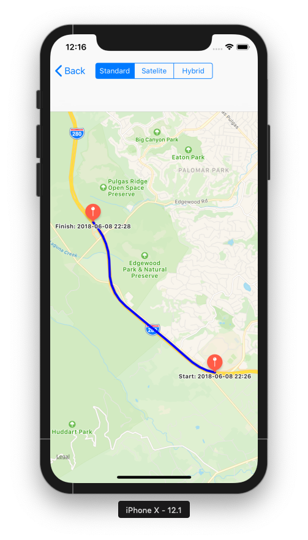
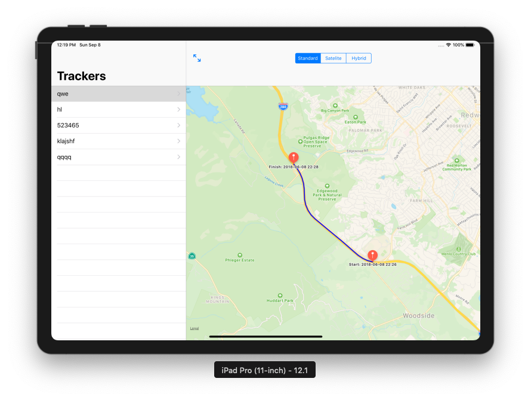

# GeoTracker

Geotracker is a set of applications that helps to emulate a GPS-tracker device and then view its movement with client-app.

## Tracker App
 

## Client App
 

Also supports iPad

This project consists of 3 parts: 

 - Tracker-app, that tracks movement of device and send its route to API;
 - API, that stores all collected data from tracker-app;
 - Client-app, that loads all stored data from API and visualises it on map.

## Installation

Download project and do `pod install` for both tracker and client apps. **Notice**: you need to host API yourself to ensure that all runs properly.
